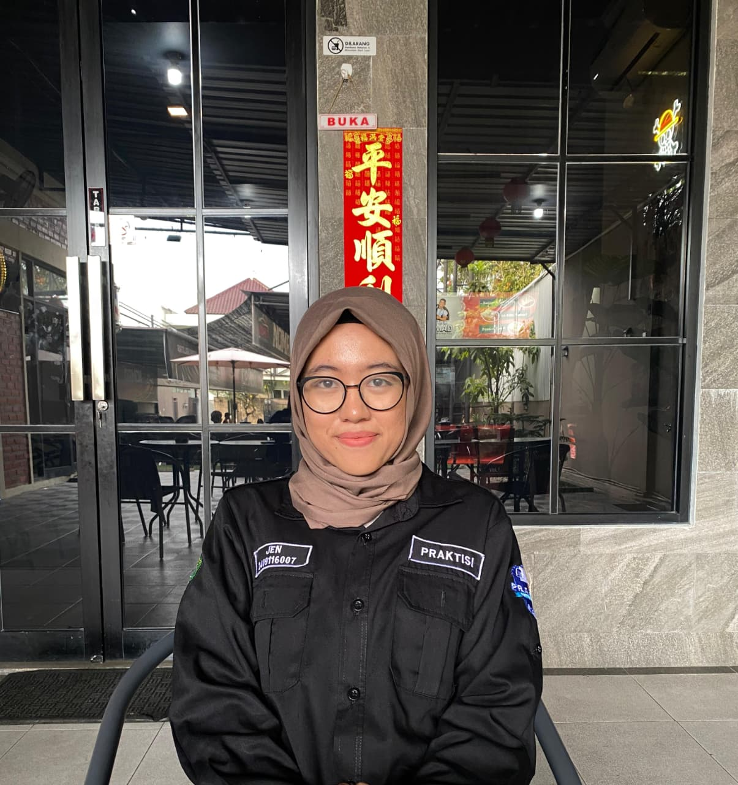

# Portfolio

Portfolio website pribadi. Menampilkan informasi profil, skill, pengalaman, dan sertifikat.

## 🔗 Live Demo
👉 https://jenam06.github.io/PBW-Portofolio/

> Jen Agresia Misti | 2409116007 | A'24 | MINPRO 1

---

## Daftar Isi 𓇼 ⋆.˚ 𓆉 𓆝 𓆡⋆.˚ 𓇼

- [Struktur File](#struktur-file)
- [Teknologi yang Digunakan](#teknologi-yang-digunakan)
- [Arsitektur](#arsitektur)
- [Alur Kerja](#alur-kerja)
- [Fitur Utama](#fitur-utama)
- [Tampilan & Fitur](#tampilan--fitur)
  - [1. Navbar](#1-navbar)
  - [2. Hero / Home](#2-hero--home)
  - [3. About Me](#3-about-me)
  - [4. Certificates](#4-certificates)
  - [5. Footer](#5-footer)
- [CSS](#css)
- [Vue.js Data & Konfigurasi](#vuejs-data--konfigurasi)
  

---

## Struktur File

```
portfolio/
├── index.html
├── style.css
└── aset/
    ├── profil.jpeg
    ├── dicoding.png
    ├── KC.png
    └── staff.png
```
---

## Teknologi yang Digunakan

| Teknologi | Keterangan |
|---|---|
| **HTML5** | Struktur dan markup halaman |
| **CSS3** | Custom styling, animasi, dan variabel warna |
| **Bootstrap 5.3** | Layout grid, navbar, komponen responsif |
| **Bootstrap Icons 1.10.5** | Icon sosial media dan UI |
| **Vue.js 3** | Reaktivitas data, rendering dinamis |
| **Google Fonts** | Font `Playfair Display` dan `DM Sans` |

---


## Arsitektur

Project ini adalah single-file portfolio tanpa build tools. Ketiga bagian utama bekerja bersama dengan alur yang sederhana:

```
index.html
├── Vue.js (data & reaktivitas)
│   ├── data()          → sumber semua konten (nama, skill, pengalaman, sertifikat)
│   └── .mount('#app')  → menghubungkan Vue ke elemen HTML
├── Bootstrap 5         → layout grid, navbar, komponen UI responsif
└── style.css           → tampilan custom, animasi, dan variabel warna
```
---

## Alur kerja:
1. **Data diisi** di `data()` Vue seperti nama, skill, pengalaman, sertifikat
2. **HTML membaca data** menggunakan Vue template syntax (`{{ }}`, `v-for`, `:style`, dll)
3. **CSS mengatur tampilan**, Bootstrap menangani layout, `style.css` menangani desain custom

Dengan pendekatan ini, untuk memperbarui isi portfolio cukup edit bagian `data()` tanpa menyentuh struktur HTML maupun CSS sama sekali.

---

## Fitur Utama

- Responsive design (mobile & desktop)
- Dynamic rendering menggunakan Vue.js
- Scrollable experience section
- Animated hero image
- Custom theme menggunakan CSS variables

---

## Tampilan & Fitur

### 1. Navbar

Navigasi tetap (fixed-top) yang transparan dengan efek shadow, berisi nama dan link ke setiap section. Navbar selalu terlihat di bagian atas halaman meski pengunjung scroll ke bawah. Di layar besar, link navigasi tampil berjajar. Di HP atau tablet, menu disembunyikan dan bisa dibuka lewat tombol ikon garis tiga (hamburger).

| Desktop Navbar |  |
|---------------|----------------------------------------|
| Mobile Navbar | |


#### Fitur Utama
- Selalu terlihat di atas saat halaman di-scroll
- Menu otomatis menyesuaikan tampilan di HP maupun desktop
- Link navigasi muncul otomatis sesuai data yang didefinisikan
- Efek warna saat link di-hover

<details>
<summary>Penjelasan Kode HTML & CSS</summary>

**HTML:**
```html

  <nav class="navbar navbar-expand-lg navbar-light fixed-top shadow-sm bg-white">
    <div class="container">
      <a class="navbar-brand fw-bold" href="#home">{{ name }}</a>
      <button class="navbar-toggler" type="button" data-bs-toggle="collapse" data-bs-target="#navbarNav"
              aria-controls="navbarNav" aria-expanded="false"
              aria-label="Open navigation menu" title="Open navigation menu">
        <span class="navbar-toggler-icon"></span>
      </button>
      <div class="collapse navbar-collapse justify-content-end" id="navbarNav">
        <ul class="navbar-nav gap-2">
          <li class="nav-item" v-for="link in navLinks" :key="link.href">
            <a class="nav-link nav-link-custom" :href="link.href">{{ link.label }}</a>
          </li>
        </ul>
      </div>
    </div>
  </nav>

```
- `fixed-top` → navbar selalu menempel di atas layar saat halaman di-scroll.
- `navbar-expand-lg` → navbar tampil horizontal di layar besar; di mobile menjadi collapsed (hamburger).
- `data-bs-toggle="collapse"` + `data-bs-target="#navbarNav"` → Bootstrap JS yang mengatur tombol hamburger membuka/menutup menu.
- `{{ name }}` → menampilkan nama dari variabel `name` di Vue `data()`.
- `v-for="link in navLinks"` → Vue merender `<li>` secara otomatis untuk setiap item dalam array `navLinks`.
- `:href="link.href"` dan `{{ link.label }}` → href dan teks link diambil dinamis dari tiap objek di array.

**CSS:**
```css
.navbar {
  padding: 14px 0;
  border-bottom: 1px solid var(--border);
  transition: box-shadow .3s;
}
.navbar-brand {
  font-family: var(--font-display);
  font-size: 1.4rem;
  color: var(--text-dark) !important;
}
.nav-link-custom {
  color: var(--text-muted) !important;
  padding: 6px 14px !important;
  border-radius: 8px;
  transition: color .25s, background .25s;
}
.nav-link-custom:hover {
  color: var(--accent) !important;
  background: var(--accent-light);
}

```
- `border-bottom` menggunakan variabel `--border` dari `:root` untuk konsistensi warna.
- Efek hover mengubah warna teks menjadi accent (sage green) dan memberi background soft.
- `!important` digunakan untuk override warna default dari Bootstrap yang sudah terdefinisi.

</details>

---

### 2. Hero / Home

Halaman pertama yang dilihat saat membuka portfolio. Menampilkan foto profil, nama, title, dan kalimat perkenalan singkat. Ada dua tombol yang bisa diklik untuk langsung berpindah ke section About atau Certificates.

| Desktop View | Mobile View |
|--------------|------------|
| | |

#### Fitur Utama
- Foto profil dengan hiasan dua lingkaran berputar di sekelilingnya
- Nama, title (teks warna hijau), dan deskripsi ditampilkan dari data yang sudah diisi
- Dua tombol navigasi cepat ke section lain
- Di HP, foto tampil di atas dan teks di bawah

<details>
<summary>📄 Penjelasan Kode — HTML & CSS</summary>

**HTML:**

```html
<section id="home" class="hero-section d-flex align-items-center">
    <div class="container">
      <div class="row align-items-center g-5">
        <div class="col-lg-6 order-2 order-lg-1">
          <p class="text-muted mb-1 small text-uppercase letter-spacing">Hi! I'm</p>
          <h1 class="hero-title mb-3">{{ name }}</h1>
          <h4 class="hero-subtitle mb-4">{{ title }}</h4>
          <p class="hero-desc text-muted mb-5">{{ heroDesc }}</p>
          <div class="d-flex gap-3 flex-wrap">
            <a href="#about" class="btn btn-primary-custom">About Me</a>
            <a href="#certificates" class="btn btn-outline-custom">View Certificates</a>
          </div>
        </div>
        <div class="col-lg-6 order-1 order-lg-2 text-center">
          <div class="hero-img-wrapper">
            
          </div>
        </div>
      </div>
    </div>
  </section>

```

- `order-2 order-lg-1` / `order-1 order-lg-2` → di mobile foto tampil di atas teks; di desktop teks di kiri dan foto di kanan.
- `{{ name }}`, `{{ title }}`, `{{ heroDesc }}` → semua konten teks diambil dari `data()` Vue.js.
- `flex-wrap` → jika layar terlalu sempit, tombol CTA otomatis turun ke baris baru.
- `btn-primary-custom` → tombol solid; `btn-outline-custom` → tombol transparan dengan border.

**CSS:**

```css
.hero-section {
  min-height: 100vh;
  padding-top: 90px;
}
.hero-title {
  font-family: var(--font-display);
  font-size: clamp(2.4rem, 5vw, 3.6rem);
}
.hero-img-wrapper::before {
  content: '';
  position: absolute;
  inset: -12px;
  border-radius: 50%;
  border: 2px dashed #a8c5b0;
  animation: spin 18s linear infinite;
}
.hero-img-wrapper::after {
  content: '';
  position: absolute;
  inset: -24px;
  border-radius: 50%;
  border: 2px solid #edf4f0;
}
@keyframes spin { to { transform: rotate(360deg); } }
.hero-img {
  border-radius: 50%;
  object-fit: cover;
  border: 6px solid var(--bg-white);
  z-index: 1;
}
```

- `min-height: 100vh` → hero selalu mengisi satu layar penuh; `padding-top: 90px` agar tidak tertutup navbar fixed.
- `clamp(2.4rem, 5vw, 3.6rem)` → ukuran font judul responsif otomatis antara mobile dan desktop.
- `::before` dan `::after` → dua pseudo-element yang membentuk lingkaran dekoratif di sekeliling foto.
- `animation: spin 18s linear infinite` → lingkaran putus-putus (`::before`) berputar terus-menerus.
- `z-index: 1` → memastikan foto tampil di atas kedua lingkaran dekoratif.

</details>

---

### 3. About Me

Section ini memperkenalkan diri lebih dalam. Berisi teks deskripsi, bar kemampuan (skill), dan daftar pengalaman organisasi maupun akademik. Daftar pengalaman bisa di-scroll jika jumlahnya banyak tanpa membuat halaman jadi terlalu panjang.

| Desktop View | Mobile View |
|--------------|------------|
| | |

#### Fitur Utama
- Bar skill dengan persentase yang bisa diubah langsung dari data
- Daftar pengalaman bisa di-scroll di dalam kotak tersendiri
- Setiap kartu pengalaman menampilkan jabatan, tempat, periode, dan deskripsi singkat
- Semua data skill dan pengalaman cukup diisi sekali di bagian data Vue

<details>
<summary>Penjelasan Kode HTML & CSS</summary>

**HTML — Skill Bars:**

```html
<div v-for="skill in skills" :key="skill.name" class="mb-3">
    <div class="d-flex justify-content-between mb-1">
        <span class="small fw-medium">{{ skill.name }}</span>
        <span class="small text-muted">{{ skill.level }}%</span>
    </div>
    <div class="progress progress-custom"
        role="progressbar":aria-valuenow="skill.level"
        aria-valuemin="0"
        aria-valuemax="100":aria-label="skill.name + ' skill level: ' + skill.level + ' percent'"
        :title="skill.name + ': ' + skill.level + '%'">
        <div class="progress-bar progress-bar-custom"
            :style="{ width: skill.level + '%' }"
            aria-hidden="true">
        </div>
    </div>
</div>

```

- `v-for="skill in skills"` → merender satu blok progress bar untuk setiap item di array `skills`.
- `:style="{ width: skill.level + '%' }"` → lebar bar ditentukan langsung dari nilai `level` di data Vue.
- `role="progressbar"` + `:aria-valuenow` → untuk aksesibilitas screen reader.

**HTML — Experience Scrollable:**

```html
<div class="col-lg-6">
    <h5 class="fw-semibold mb-4">Experience</h5>
    <div class="experience-scroll">
        <div v-for="exp in experiences" :key="exp.role" class="experience-card mb-3 p-3">
            <div class="d-flex justify-content-between align-items-start">
                <div>
                  <p class="mb-0 fw-semibold">{{ exp.role }}</p>
                  <p class="mb-0 small text-muted">{{ exp.company }}</p>
                </div>
                <span class="badge-period">{{ exp.period }}</span>
            </div>
              <p class="mt-2 mb-0 small text-muted">{{ exp.desc }}</p>
        </div>
    </div>
</div>
```

- `v-for="exp in experiences"` → merender kartu untuk setiap objek di array `experiences`.
- `.experience-scroll` → wrapper dengan `max-height` dan `overflow-y: auto` agar kartu bisa di-scroll.
- `badge-period` → tag kecil berbentuk pill untuk menampilkan periode waktu.

**CSS:**

```css
.progress-bar-custom {
  background: var(--accent);
  transition: width 1.2s ease;
}
.experience-scroll {
  max-height: 380px;
  overflow-y: auto;
}
.experience-scroll::-webkit-scrollbar-thumb {
  background: #a8c5b0;
  border-radius: 99px;
}
.experience-card:hover { box-shadow: var(--shadow-md); }
.badge-period {
  background: var(--accent-light);
  color: var(--accent);
  border-radius: 99px;
  white-space: nowrap;
}
```

- `transition: width 1.2s ease` → animasi smooth saat progress bar "mengisi" dari kiri ke kanan.
- `max-height` + `overflow-y: auto` → daftar experience bisa di-scroll tanpa memanjangkan halaman.
- `::-webkit-scrollbar-thumb` → styling scrollbar custom agar sesuai palet warna sage green.
- `white-space: nowrap` → teks periode tidak terpotong ke baris baru.

</details>

---

### 4. Certificates

Menampilkan koleksi sertifikat yang telah diraih dalam bentuk kartu bergambar. Setiap kartu menunjukkan foto sertifikat, kategori, nama sertifikat, penerbit, dan tanggal terbit. Saat kartu di-hover, ada efek naik dan gambar sedikit membesar.

| Desktop View | Mobile View |
|--------------|------------|
| | 

#### Fitur Utama
- Tampilan kartu berjejer rapi, otomatis menyesuaikan jumlah kolom di tiap ukuran layar
- Setiap kartu menampilkan gambar, kategori, judul, penerbit, dan tanggal
- Efek hover pada kartu: terangkat dan gambar sedikit zoom
- Cukup tambah data di array `certificates` untuk menambah kartu baru

<details>
<summary>Penjelasan Kode HTML & CSS</summary>

**HTML:**

```html
<div class="row g-4">
    <div class="col-md-6 col-lg-4" v-for="cert in certificates" :key="cert.title">
        <div class="cert-card h-100">
            <div class="cert-img-wrapper">
              
              <span class="cert-category-overlay">{{ cert.category }}</span>
            </div>
            <div class="cert-body">
              <h6 class="cert-title mb-1">{{ cert.title }}</h6>
              <p class="small text-muted mb-2">{{ cert.issuer }}</p>
              <p class="small text-muted mb-0">
                <i class="bi bi-calendar3 me-1" aria-hidden="true"></i>{{ cert.date }}
              </p>
            </div>
        </div>
    </div>
</div>

```

- `col-md-6 col-lg-4` → layout responsif: 1 kolom di mobile, 2 kolom di tablet, 3 kolom di desktop.
- `v-for="cert in certificates"` → merender satu kartu untuk setiap objek di array `certificates`.
- `:src="cert.img"` / `:alt` / `:title` → semua atribut gambar diisi dinamis dari data Vue.
- `cert-category-overlay` → badge kategori yang mengambang di pojok kiri atas gambar.
- `h-100` → semua kartu dalam satu baris memiliki tinggi yang sama.
- `bi bi-calendar3` → ikon kalender dari Bootstrap Icons.

**CSS:**

```css
.cert-card:hover {
  box-shadow: var(--shadow-md);
  transform: translateY(-4px);
}
.cert-img {
  object-fit: cover;
  object-position: center top;
  transition: transform .4s ease;
}
.cert-card:hover .cert-img { transform: scale(1.05); }
.cert-category-overlay {
  position: absolute;
  top: 12px;
  left: 12px;
  background: rgba(255,255,255,0.92);
  backdrop-filter: blur(4px);
  border-radius: 99px;
}
.cert-body {
  display: flex;
  flex-direction: column;
  flex: 1;
}
```

- `translateY(-4px)` saat hover → efek kartu terangkat.
- `object-position: center top` → prioritaskan bagian atas gambar agar judul sertifikat tidak terpotong.
- `scale(1.05)` → gambar sedikit zoom saat kartu di-hover.
- `backdrop-filter: blur(4px)` → efek frosted glass pada badge kategori.
- `flex: 1` pada `.cert-body` → konten kartu terdistribusi rapi meski panjang teks berbeda.

</details>

---

## 5. Footer

Bagian paling bawah halaman yang menampilkan nama dan tiga ikon sosial media. Sederhana dan bersih, dengan warna hijau sage di seluruh halaman.

| Desktop Footer |  |
|---------------|----------------------------------------|
| Mobile Footer | |

#### Fitur Utama
- Menampilkan nama pemilik portfolio
- Tiga ikon sosial media: GitHub, LinkedIn, dan Instagram
- Ikon berubah warna dan sedikit naik saat di-hover

<details>
<summary>Penjelasan Kode HTML & CSS</summary>

**HTML:**

```html
  <footer class="footer-section text-center py-4">
    <p class="mb-1 small text-muted">{{ name }}</p>
    <div class="d-flex justify-content-center gap-3 mt-2">
      <a href="https://github.com/JenAM06" class="social-link" aria-label="GitHub profile" title="GitHub profile">
        <i class="bi bi-github" aria-hidden="true"></i>
        <span class="visually-hidden">GitHub</span>
      </a>
      <a href="https://linkedin.com/in/username" class="social-link" aria-label="LinkedIn profile" title="LinkedIn profile">
        <i class="bi bi-linkedin" aria-hidden="true"></i>
        <span class="visually-hidden">LinkedIn</span>
      </a>
      <a href="https://www.instagram.com/agresia_jen/" class="social-link" aria-label="Instagram profile" title="Instagram profile">
        <i class="bi bi-instagram" aria-hidden="true"></i>
        <span class="visually-hidden">Instagram</span>
      </a>
    </div>
  </footer>

```

- `bi bi-github` / `bi-linkedin` / `bi-instagram` → ikon sosial media dari Bootstrap Icons.
- `aria-label` → teks deskriptif untuk screen reader karena link hanya berisi ikon tanpa teks terlihat.
- `visually-hidden` → teks "GitHub", "LinkedIn", dst. hanya terbaca screen reader, tidak tampil secara visual.
- `{{ name }}` → nama pemilik portfolio ditampilkan dari data Vue.

**CSS:**

```css
.footer-section {
  border-top: 1px solid var(--border);
  background: var(--bg-light);
}
.social-link {
  display: inline-block;
  transition: color .2s, transform .2s;
}
.social-link:hover {
  color: var(--accent);
  transform: translateY(-2px);
}
```

- `border-top` → garis tipis pemisah footer dari section di atasnya.
- `display: inline-block` → diperlukan agar `transform` bisa bekerja pada elemen `<a>` yang secara default inline.
- `translateY(-2px)` saat hover → ikon sedikit naik untuk efek interaktif.

</details>

## CSS 

**Variabel `:root`:**

```css
:root {
  --accent:        #4a7c59;
  --accent-light:  #edf4f0;
  --accent-dark:   #355c42;
  --text-dark:     #1c2b22;
  --text-muted:    #6b7f72;
  --bg-white:      #ffffff;
  --bg-light:      #f5f8f6;
  --border:        #d6e4da;
  --radius:        12px;
  --shadow-sm:     0 1px 3px rgba(74,124,89,.08);
  --shadow-md:     0 4px 16px rgba(74,124,89,.12);
  --font-display:  'Playfair Display', serif;
  --font-body:     'DM Sans', sans-serif;
}
```

Semua warna, font, radius, dan shadow didefinisikan di `:root` sebagai CSS Custom Properties. Keuntungannya: untuk mengubah tema warna cukup edit di satu tempat saja.

<details>
<summary>Penjelasan Base Style</summary>

**Base Style:**

```css
*, *::before, *::after { box-sizing: border-box; }
html { scroll-behavior: smooth; }
body {
  font-family: var(--font-body);
  color: var(--text-dark);
  background-color: var(--bg-white);
  font-size: 15px;
  line-height: 1.6;
}
```

- `box-sizing: border-box` → padding dan border tidak menambah lebar elemen, layout lebih mudah diprediksi.
- `scroll-behavior: smooth` → navigasi anchor link berjalan dengan animasi scroll halus.

**Responsive:**

```css
@media (max-width: 768px) {
  .hero-img { width: 220px; height: 220px; }
}
@media (max-width: 576px) {
  .section-padding { padding: 64px 0; }
  .hero-section { padding-top: 80px; }
}
```

Breakpoint kustom untuk tampilan rapi di layar tablet dan mobile.

</details>

---

## Vue.js Data & Konfigurasi

Semua konten yang tampil di halaman diambil dari satu tempat bagian `data()` di dalam script Vue. Untuk mengubah isi portfolio, cukup edit nilai-nilai di sini tanpa perlu menyentuh struktur HTML sama sekali.

<details>
<summary>Penjelasan Kode Vue Data</summary>

**Inisialisasi Vue & CDN:**

```html

<!-- Bootstrap JS -->
<script src="https://cdn.jsdelivr.net/npm/bootstrap@5.3.0/dist/js/bootstrap.bundle.min.js"></script>
<!-- Vue 3 -->
<script src="https://unpkg.com/vue@3/dist/vue.global.js"></script>

```

- Kedua library dimuat via CDN, tidak perlu instalasi apapun.
- Bootstrap JS diperlukan untuk fitur collapse (hamburger menu).
- Vue 3 dimuat sebagai `vue.global.js` sehingga bisa langsung dipakai di browser tanpa build tools.

**Struktur Utama Vue:**

```js
const { createApp } = Vue;

createApp({
  data() {
    return {
      // semua data konten di sini
    };
  },
}).mount('#app');
```

- `createApp()` → membuat instance Vue baru.
- `data()` → fungsi yang mengembalikan semua data reaktif yang dipakai di template HTML.
- `.mount('#app')` → menghubungkan Vue ke elemen `<div id="app">` di HTML, sehingga semua konten di dalamnya bisa menggunakan data Vue.

**Data Konten:**

```js
name: 'Jen Agresia Misti',
title: 'Laboratory Assistant & Tech Enthusiast',
heroDesc: 'An Information Systems student passionate about technology and data. I believe that the learning process is the key to growth.',
aboutDesc: 'I am someone with a deep interest in technology and data development...',
```

- Variabel teks yang ditampilkan di Hero dan About. Untuk mengubah nama, jabatan, atau deskripsi cukup edit nilai string di sini.

**Data Navigasi:**

```js
navLinks: [
  { href: '#home',         label: 'Home' },
  { href: '#about',        label: 'About Me' },
  { href: '#certificates', label: 'Certificates' },
],
```

- Array objek yang menentukan link apa saja yang muncul di navbar. Untuk menambah menu baru, cukup tambah satu objek baru dengan `href` dan `label`.

**Data Skill:**

```js
skills: [
  { name: 'Communication',   level: 85 },
  { name: 'Leadership',      level: 90 },
  { name: 'Problem Solving', level: 85 },
],
```

- Setiap objek menghasilkan satu baris progress bar di section About. `level` adalah nilai persentase (0–100) yang menentukan panjang bar.

**Data Pengalaman:**

```js
experiences: [
  {
    role: 'Laboratory Assistant – Introduction to IT',
    company: 'Universitas Mulawarman',
    period: '2025',
    desc: 'Taught the use of Word, Excel, Canva, and AI tools for students academic needs.',
  },
  // ...
],
```

- Setiap objek menghasilkan satu kartu di daftar Experience. Tambah objek baru untuk menambah entri pengalaman.

**Data Sertifikat:**

```js
certificates: [
  {
    title: 'Data Science Tools Training',
    issuer: 'Dicoding Indonesia',
    date: 'February 2026',
    category: 'Data Science',
    img: 'aset/dicoding.png',
  },
  // ...
],
```

- Setiap objek menghasilkan satu kartu di section Certificates. `img` adalah path ke file gambar sertifikat di folder `aset/`.

</details>

---

